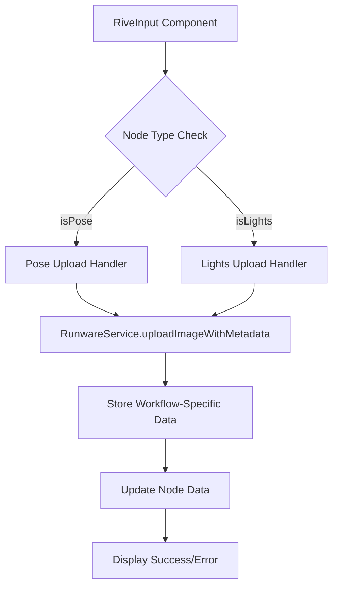

# Design Document

## Overview

This design enhances the RiveInput component to properly integrate with the runwareService for uploading images with workflow-specific metadata. The current implementation uploads images but doesn't differentiate between pose control (ControlNet) and lighting control (seed image) use cases. This enhancement will ensure proper metadata storage and workflow integration.

## Architecture

### Current State Analysis

The RiveInput component currently:
- Uses a hardcoded API key for runwareService
- Calls `runwareService.uploadImage(dataUrl)` incorrectly (expects File, receives string)
- Stores basic image data without workflow-specific metadata
- Doesn't distinguish between pose and lighting upload purposes

### Proposed Architecture



## Components and Interfaces

### Enhanced RunwareService Interface

```typescript
// New method to be added to RunwareService
async uploadImageWithMetadata(imageFile: File): Promise<UploadedImage> {
  // Returns both imageUUID and imageURL
  // Handles authentication and error management
}

// Existing interface to be used
interface UploadedImage {
  imageUUID: string;
  imageURL: string;
}
```

### RiveInput Component Enhancements

#### Data URL to File Conversion
```typescript
// Utility function to convert canvas data URL to File object
const dataUrlToFile = (dataUrl: string, filename: string): File => {
  const arr = dataUrl.split(',');
  const mime = arr[0].match(/:(.*?);/)?.[1] || 'image/png';
  const bstr = atob(arr[1]);
  let n = bstr.length;
  const u8arr = new Uint8Array(n);
  while (n--) {
    u8arr[n] = bstr.charCodeAt(n);
  }
  return new File([u8arr], filename, { type: mime });
};
```

#### Enhanced Upload Handler
```typescript
const handleDone = async () => {
  if (!canvasRef.current || !runwareService || !selectedNode) {
    // Handle error cases
    return;
  }

  try {
    const canvas = canvasRef.current;
    const dataUrl = canvas.toDataURL('image/png');
    
    // Convert data URL to File object
    const imageFile = dataUrlToFile(dataUrl, `${nodeType}-${Date.now()}.png`);
    
    // Set loading state
    updateNodeData(selectedNode.id, { isUploading: true });

    // Upload with proper File object
    const { imageUUID, imageURL } = await runwareService.uploadImageWithMetadata(imageFile);
    
    // Store workflow-specific metadata
    const workflowData = getWorkflowSpecificData(nodeType, imageUUID, imageURL);
    
    updateNodeData(selectedNode.id, {
      ...workflowData,
      isUploading: false
    });

    toast.success('Image uploaded successfully!');
    
  } catch (error) {
    handleUploadError(error);
  }
};
```

## Data Models

### Node Data Structure

#### For Pose Nodes (ControlNet Usage)
```typescript
interface PoseNodeData {
  // Existing data...
  image: string;           // imageURL for display
  imageUrl: string;        // imageURL for compatibility
  imageUUID: string;       // UUID for Runware API calls
  workflowType: 'controlnet';
  controlnetConfig: {
    guideImage: string;    // imageURL for ControlNet
    preprocessor?: string; // If preprocessing was applied
  };
  isUploading: boolean;
}
```

#### For Lighting Nodes (Seed Image Usage)
```typescript
interface LightingNodeData {
  // Existing data...
  image: string;           // imageURL for display
  imageUrl: string;        // imageURL for compatibility
  imageUUID: string;       // UUID for Runware API calls
  workflowType: 'seedImage';
  seedImageConfig: {
    seedImage: string;     // imageURL for seed image
  };
  isUploading: boolean;
}
```

### Workflow-Specific Data Factory

```typescript
const getWorkflowSpecificData = (nodeType: string, imageUUID: string, imageURL: string) => {
  const baseData = {
    image: imageURL,
    imageUrl: imageURL,
    imageUUID: imageUUID,
  };

  if (nodeType.includes('pose')) {
    return {
      ...baseData,
      workflowType: 'controlnet' as const,
      controlnetConfig: {
        guideImage: imageURL,
      },
    };
  }

  if (nodeType.includes('lights')) {
    return {
      ...baseData,
      workflowType: 'seedImage' as const,
      seedImageConfig: {
        seedImage: imageURL,
      },
    };
  }

  return baseData;
};
```

## Error Handling

### Error Categories and Responses

1. **Canvas Not Available**
   - Display: "Canvas not ready. Please try again."
   - Action: Maintain current state, allow retry

2. **RunwareService Not Available**
   - Display: "Upload service unavailable. Please check your connection."
   - Action: Maintain current state, suggest refresh

3. **File Conversion Errors**
   - Display: "Failed to prepare image for upload."
   - Action: Log error, maintain current state

4. **Upload Failures**
   - Display: "Upload failed: [specific error message]"
   - Action: Reset uploading state, allow retry

5. **Network/Authentication Errors**
   - Display: "Connection error. Please check your API key and try again."
   - Action: Reset uploading state, suggest configuration check

### Error Handler Implementation

```typescript
const handleUploadError = (error: unknown) => {
  console.error('Upload error:', error);
  
  updateNodeData(selectedNode.id, { isUploading: false });
  
  if (error instanceof RunwareError) {
    switch (error.type) {
      case ErrorType.AUTHENTICATION_ERROR:
        toast.error('Authentication failed. Please check your API key.');
        break;
      case ErrorType.NETWORK_ERROR:
        toast.error('Network error. Please check your connection and try again.');
        break;
      case ErrorType.VALIDATION_ERROR:
        toast.error(`Invalid input: ${error.message}`);
        break;
      default:
        toast.error(`Upload failed: ${error.message}`);
    }
  } else {
    toast.error('An unexpected error occurred during upload.');
  }
};
```

## Testing Strategy

### Unit Tests

1. **Data URL to File Conversion**
   - Test valid data URLs convert correctly
   - Test invalid data URLs handle gracefully
   - Test file metadata (name, type, size)

2. **Workflow Data Factory**
   - Test pose node data structure
   - Test lighting node data structure
   - Test unknown node type fallback

3. **Error Handling**
   - Test each error type displays correct message
   - Test state management during errors
   - Test retry functionality

### Integration Tests

1. **RunwareService Integration**
   - Test successful upload flow
   - Test authentication failures
   - Test network failures
   - Test timeout scenarios

2. **Node Data Updates**
   - Test correct metadata storage for pose nodes
   - Test correct metadata storage for lighting nodes
   - Test loading state management

### End-to-End Tests

1. **Complete Upload Flow**
   - User creates pose/lighting content
   - User clicks "Done"
   - Image uploads successfully
   - Correct metadata stored
   - Success feedback displayed

2. **Error Recovery**
   - Upload fails
   - Error message displayed
   - User can retry
   - Successful retry works

## Implementation Notes

### RunwareService Enhancement

The existing `uploadImage` method returns only UUID. We need to add a new method that returns both UUID and URL, or modify the existing method to return the `UploadedImage` interface.

### Backward Compatibility

The changes maintain backward compatibility by:
- Keeping existing `image` and `imageUrl` properties
- Adding new properties without removing old ones
- Maintaining existing component behavior for non-upload scenarios

### Performance Considerations

- File conversion happens synchronously but is fast for typical canvas sizes
- Upload happens asynchronously with proper loading states
- Error handling prevents UI blocking
- Retry mechanisms prevent permanent failures from temporary issues