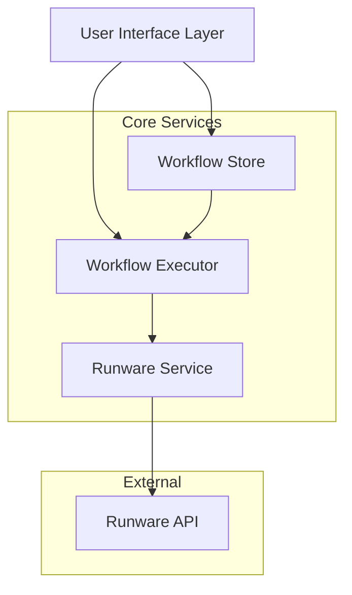
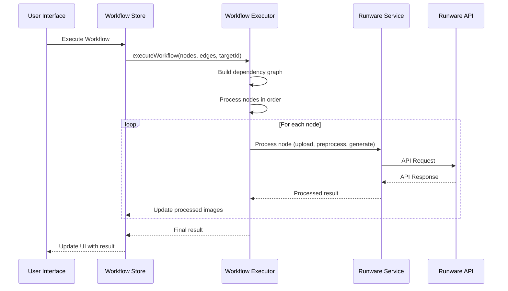
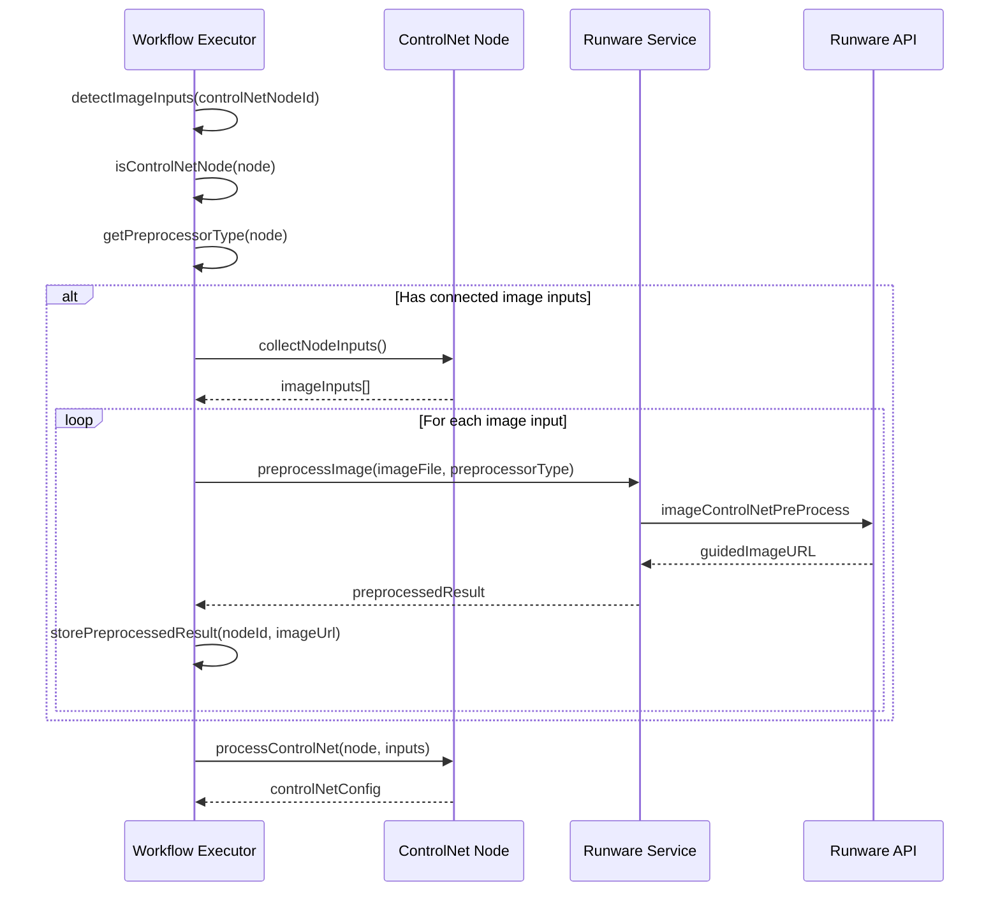

# Design Document

## Overview

The Runware Workflow Execution system is a comprehensive solution for processing visual node-based workflows that integrate with Runware AI APIs. The system supports four main workflow types: text-to-image generation with ControlNet preprocessing, image-to-image transformation, FLUX Kontext operations, and image editing tools. The architecture follows a service-oriented pattern with clear separation of concerns between API communication, workflow execution logic, and state management.

## Architecture

### High-Level Architecture



### Service Layer Architecture

The system is built around three core services:

1. **RunwareService**: Handles all API communication with Runware endpoints
2. **WorkflowExecutor**: Orchestrates workflow execution and node processing
3. **WorkflowStore**: Manages application state and workflow data

### Data Flow Architecture



## Components and Interfaces

### RunwareService Interface

The RunwareService provides a comprehensive API wrapper for all Runware operations:

```typescript
interface RunwareService {
  // Image Upload
  uploadImage(imageFile: File): Promise<string>
  uploadImageForURL(imageFile: File): Promise<string>
  
  // Preprocessing
  preprocessImage(imageFile: File, preprocessor: string): Promise<PreprocessedImage>
  
  // Generation Methods
  generateImage(params: GenerateImageParams): Promise<GeneratedImage>
  generateImageToImage(params: ImageToImageParams): Promise<GeneratedImage>
  generateFluxKontext(params: FluxKontextParams): Promise<GeneratedImage>
  generateFluxKontextPro(params: FluxKontextParams): Promise<GeneratedImage>
  
  // Specialized Flux Methods
  generateReference(inputImage: string, prompt: string, referenceType: string): Promise<GeneratedImage>
  generateReScene(objectImage: string, sceneImage: string): Promise<GeneratedImage>
  generateReAngle(inputImage: string, degrees: number, direction: string): Promise<GeneratedImage>
  generateReMix(inputImages: string[]): Promise<GeneratedImage>
  
  // Image Processing Tools
  removeBackground(params: RemoveBackgroundParams): Promise<ProcessedImageResult>
  upscaleImage(params: UpscaleParams): Promise<ProcessedImageResult>
  inpaintImage(params: InpaintParams): Promise<GeneratedImage>
  outpaintImage(params: OutpaintParams): Promise<GeneratedImage>
}
```

### WorkflowExecutor Interface

The WorkflowExecutor orchestrates the execution of node-based workflows:

```typescript
interface WorkflowExecutor {
  executeWorkflow(nodes: Node[], edges: Edge[], targetNodeId: string): Promise<string | null>
  clearProcessedImages(): void
  
  // Private node processing methods
  private executeNode(nodeId: string, nodeMap: Map<string, Node>, edgeMap: Map<string, Edge[]>): Promise<string | null>
  private processImageInput(node: Node): Promise<string | null>
  private processControlNet(node: Node, inputs: Record<string, string>): Promise<string | null>
  private processGeneration(node: Node, inputs: Record<string, string>): Promise<string | null>
  private processTool(node: Node, inputs: Record<string, string>): Promise<string | null>
  private processEngine(node: Node, inputs: Record<string, string>): Promise<string | null>
  private processGear(node: Node, inputs: Record<string, string>): Promise<string | null>
  private processOutput(node: Node, inputs: Record<string, string>): Promise<string | null>
  
  // Input detection and validation methods
  private collectNodeInputs(nodeId: string, nodeMap: Map<string, Node>, edgeMap: Map<string, Edge[]>): Promise<Record<string, string>>
  private validateNodeInputs(node: Node, inputs: Record<string, string>): boolean
  private detectImageInputs(nodeId: string, edgeMap: Map<string, Edge[]>, nodeMap: Map<string, Node>): string[]
  private isControlNetNode(node: Node): boolean
  private getPreprocessorType(node: Node): string
}
```

### Node Type Definitions

Each node type has specific data structures and processing requirements:

```typescript
interface NodeData {
  // Common properties
  id: string
  type: string
  
  // Image Input Node
  imageFile?: File
  imageUrl?: string
  imageType?: 'object' | 'scene' | 'fuse'
  
  // Text Input Node
  prompt?: string
  
  // ControlNet Node
  preprocessor?: string
  imageUrl?: string // For Rive-generated images
  
  // Engine Node
  model?: string
  width?: number
  height?: number
  steps?: number
  cfgScale?: number
  strength?: number
  loras?: Array<{model: string; weight: number}>
  
  // Gear Node
  loraModel?: string
  weight?: number
  
  // Rerendering Node
  rerenderingType?: 'reimagine' | 'reference' | 'rescene' | 'reangle' | 'remix'
  referenceType?: string
  degrees?: number
  direction?: string
  creativity?: number
  
  // Tool Node
  toolType?: 'removebg' | 'upscale' | 'inpaint' | 'outpaint'
  upscaleFactor?: 2 | 3 | 4
  maskImage?: string
  inpaintPrompt?: string
  outpaintDirection?: 'up' | 'down' | 'left' | 'right' | 'all'
  outpaintAmount?: number
  
  // Output Node
  generatedImage?: string
}
```

## Automatic ControlNet Preprocessing Architecture

### Preprocessing Detection Flow



### Input Detection Architecture

The system uses a multi-layered approach to detect and validate node inputs:

1. **Edge Mapping**: Build efficient lookup maps for node connections
2. **Input Collection**: Gather all input data from connected source nodes
3. **Type Validation**: Ensure inputs match expected data types
4. **Automatic Processing**: Trigger preprocessing for ControlNet nodes with image inputs

```typescript
interface InputDetectionSystem {
  // Core detection methods
  buildEdgeMap(edges: Edge[]): Map<string, Edge[]>
  collectNodeInputs(nodeId: string): Promise<Record<string, string>>
  
  // ControlNet specific detection
  detectControlNetNodes(nodes: Node[]): Node[]
  detectImageInputsForNode(nodeId: string): string[]
  shouldAutoPreprocess(node: Node, inputs: Record<string, string>): boolean
  
  // Validation methods
  validateRequiredInputs(node: Node, inputs: Record<string, string>): ValidationResult
  getInputValidationRules(nodeType: string): InputRule[]
}
```

## Data Models

### Workflow Execution Models

```typescript
interface WorkflowExecutionContext {
  nodes: Node[]
  edges: Edge[]
  processedImages: Map<string, string>
  nodeMap: Map<string, Node>
  edgeMap: Map<string, Edge[]>
  preprocessedResults: Map<string, string> // nodeId -> guidedImageURL
}

interface NodeProcessingResult {
  nodeId: string
  result: string | null
  error?: string
  preprocessingRequired?: boolean
  inputsCollected?: Record<string, string>
}

interface WorkflowExecutionResult {
  success: boolean
  finalImageUrl?: string
  error?: string
  processedNodes: NodeProcessingResult[]
}

interface InputValidationResult {
  isValid: boolean
  missingInputs: string[]
  invalidInputs: Array<{inputName: string; expectedType: string; actualType: string}>
  errorMessage?: string
}

interface ControlNetPreprocessingResult {
  nodeId: string
  preprocessorType: string
  inputImageUrl: string
  guidedImageURL: string
  success: boolean
  error?: string
}
```

### API Parameter Models

```typescript
interface GenerateImageParams {
  positivePrompt: string
  negativePrompt?: string
  model?: string
  width?: number
  height?: number
  steps?: number
  CFGScale?: number
  scheduler?: string
  strength?: number
  seed?: number
  lora?: Array<{model: string; weight: number}>
  controlNet?: Array<{
    model: string
    guideImage: string
    weight: number
    startStep: number
    endStep: number
    controlMode: string
  }>
  seedImage?: string
  ipAdapters?: Array<{
    model: string
    guideImage: string
    weight: number
  }>
  referenceImages?: string[]
}

interface FluxKontextParams {
  positivePrompt: string
  referenceImages: string[]
  model?: string
  width?: number
  height?: number
  sizeRatio?: string
  lora?: Array<{model: string; weight: number}>
}
```

## Error Handling

### Error Classification

The system handles three categories of errors:

1. **Network Errors**: WebSocket connection issues, API timeouts
2. **Validation Errors**: Invalid parameters, missing required data
3. **Processing Errors**: API failures, image processing failures

### Error Handling Strategy

```typescript
interface ErrorHandler {
  handleNetworkError(error: Error): void
  handleValidationError(error: ValidationError): void
  handleProcessingError(error: ProcessingError): void
  
  // Retry logic for transient failures
  retryWithBackoff<T>(operation: () => Promise<T>, maxRetries: number): Promise<T>
}
```

### Error Recovery Mechanisms

- **Automatic Reconnection**: WebSocket reconnection with exponential backoff
- **Graceful Degradation**: Continue workflow execution when non-critical nodes fail
- **User Feedback**: Clear error messages with actionable guidance
- **State Preservation**: Maintain processed results during error recovery

## Testing Strategy

### Unit Testing

- **Service Layer Testing**: Mock API responses and test service methods
- **Workflow Executor Testing**: Test node processing logic with various configurations
- **State Management Testing**: Verify store updates and data persistence

### Integration Testing

- **API Integration**: Test actual Runware API communication
- **Workflow End-to-End**: Test complete workflow execution scenarios
- **Error Scenarios**: Test error handling and recovery mechanisms

### Test Data Management

```typescript
interface TestDataProvider {
  createMockNodes(type: string, count: number): Node[]
  createMockEdges(nodes: Node[]): Edge[]
  createMockApiResponses(): Record<string, any>
  createTestImages(): File[]
}
```

### Performance Testing

- **Concurrent Workflow Execution**: Test multiple simultaneous workflows
- **Large Image Processing**: Test with high-resolution images
- **Memory Usage**: Monitor memory consumption during long workflows
- **API Rate Limiting**: Test behavior under API rate limits

## Implementation Details

### WebSocket Connection Management

The RunwareService maintains a persistent WebSocket connection with automatic reconnection:

```typescript
class ConnectionManager {
  private ws: WebSocket | null = null
  private connectionPromise: Promise<void> | null = null
  private messageCallbacks: Map<string, (data: any) => void> = new Map()
  
  async connect(): Promise<void>
  async authenticate(): Promise<void>
  async sendMessage(message: any): Promise<any>
  handleReconnection(): void
}
```

### Node Dependency Resolution

The WorkflowExecutor uses topological sorting to determine execution order:

```typescript
class DependencyResolver {
  buildDependencyGraph(nodes: Node[], edges: Edge[]): Map<string, string[]>
  getExecutionOrder(dependencies: Map<string, string[]>): string[]
  detectCycles(dependencies: Map<string, string[]>): boolean
}
```

### Input Detection and Validation System

The system implements comprehensive input detection and validation:

```typescript
class InputDetectionSystem {
  // Build efficient lookup maps
  buildEdgeMap(edges: Edge[]): Map<string, Edge[]> {
    // Group edges by target node for efficient input lookup
  }
  
  // Collect all inputs for a specific node
  async collectNodeInputs(nodeId: string, nodeMap: Map<string, Node>, edgeMap: Map<string, Edge[]>): Promise<Record<string, string>> {
    // Find all edges targeting this node
    // Get source node data for each edge
    // Return organized input data
  }
  
  // ControlNet specific detection
  isControlNetNode(node: Node): boolean {
    // Check if node is pose, edge, depth, segment, normal, or light control
  }
  
  detectImageInputs(nodeId: string, edgeMap: Map<string, Edge[]>, nodeMap: Map<string, Node>): string[] {
    // Find connected image input nodes
    // Return array of image URLs/data
  }
  
  shouldAutoPreprocess(node: Node, inputs: Record<string, string>): boolean {
    // Check if node is ControlNet type and has image inputs
    // Check if preprocessing hasn't been done already
  }
}
```

### Image Processing Pipeline

Each workflow type follows a specific processing pipeline:

1. **Text-to-Image Pipeline**:
   - Upload input images → Preprocess with ControlNet → Extract LoRAs → Generate with engine
   
2. **Image-to-Image Pipeline**:
   - Upload input image → Apply tools → Generate with re-imagine node
   
3. **FLUX Kontext Pipeline**:
   - Upload reference images → Apply specialized FLUX operations → Direct output
   
4. **Tools Pipeline**:
   - Upload input image → Apply tool operation → Store result for further processing

### State Management Patterns

The WorkflowStore uses Zustand for predictable state management:

```typescript
interface WorkflowState {
  // Core state
  nodes: Node[]
  edges: Edge[]
  processedImages: Map<string, string>
  
  // Execution state
  isGenerating: boolean
  selectedNodeId: string | null
  
  // Services
  runwareService: RunwareService | null
  workflowExecutor: WorkflowExecutor | null
  
  // Actions
  executeWorkflow(targetNodeId: string): Promise<void>
  updateNodeData(nodeId: string, data: any): void
  setProcessedImage(nodeId: string, imageUrl: string): void
}
```

### Caching and Optimization

- **Image Caching**: Cache uploaded images to avoid re-uploading
- **Result Caching**: Cache processed results within workflow execution
- **Connection Pooling**: Reuse WebSocket connections across operations
- **Batch Processing**: Group similar operations when possible